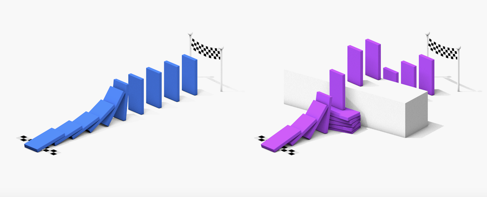

# De regels van het medium

Elk medium heeft beperkingen: een boek heeft geen beeld en theater is onderhevig aan zichtlijnen. Op Facebook geldt een gemiddelde spanningsboog van 8,25 seconden en 85% van de gebruikers kijkt filmpjes met het geluid uit. In films kan men vliegen, maar in het theater heerst er zwaartekracht, terwijl in film alles vaststaat waar theater elke keer opnieuw flexibel is. De beperkingen (en daarmee de mogelijkheden) bepalen hoe hetzelfde verhaal er in ieder medium anders uit komt te zien: een verfilming heeft niet alle teksten van het boek nodig, deels omdat beeld al veel vertelt en deels omdat een bioscoopfilm gemiddeld na zo’n twee uur wel weer klaar moet zijn.

Die beperkingen zijn niet nadelig, integendeel: het zijn obstakels die je kunt omzeilen, spelregels waar je mee kunt spelen. Beperkingen voeden creativiteit, want je wil wél dat je personage kan vliegen; hoe krijg je die suggestie met beperkte middelen dan toch gewekt? Een boek is geen film, en toch schetsen de woorden een beeld. Een zaal is één plek, en toch nemen licht, geluid en spel je naar verschillende locaties mee. Ieder medium is beperkt, en toch weten kunstenaars via de mogelijkheden het onmogelijke te communiceren. Beperkingen dagen uit om het medium ten volste te omarmen.

Die uitdaging is vaak ook nodig, want “doe maar iets” werkt in de regel blokkerend: dat is vrijheid zonder richting, een spel zonder spelregels. Een beperking werpt problemen op, problemen vragen om oplossingen, en oplossingen vragen om creativiteit. Het is als maker de kunst om jezelf van problemen te voorzien, om eigen kaders te creëren als de gegeven kaders te breed zijn, want uit creatieve problemen volgen creatievere oplossingen.

