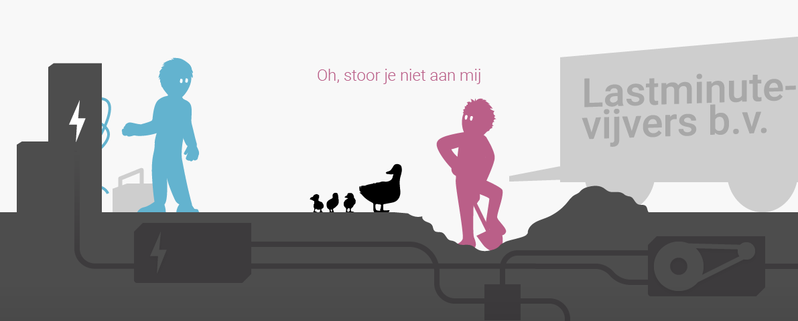
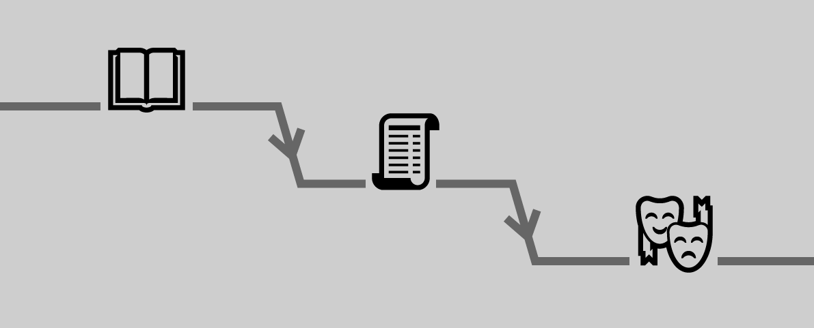

# Multidisciplinariteit

Temidden van al die beperkingen ligt een scala aan expressieve mogelijkheden zoals beeld, kleur, licht, geluid, muziek, beweging, tekst of interactie. Om daar creatief mee te kunnen spelen is het wel belangrijk om de grenzen van de beschikbare middelen te overzien: een architect kan pas creatief met vormen omgaan als hij snapt welke dingen instorten en welke blijven staan.

Voeg daar een opdrachtgever, een loodgieter en een aannemer aan toe en het wordt steeds wenselijker dat deze mensen ook van _elkaar_ begrijpen wat binnen de losse vakgebieden de mogelijkheden en obstakels zijn. Want een keuze op het ene terrein heeft een consequentie op het andere. Beter nog: de oplossing voor een probleem in het ene vakgebied kan in het andere liggen, en dat ontdek je alleen vanuit een – op zijn minst basaal – wederzijds begrip. Meerdere kaders betekent meerdere spelregels _door elkaar heen_, en in het ideale geval levert dat een creatiever spel op, met een diepere samenhang en een grotere wisselwerking tot gevolg. Aparte eilandjes en onbegrip staan zo’n wisselwerking in de weg.

## Interdisciplinariteit

In die samenhang ligt wat mij betreft de meerwaarde van het interdisciplinair werken. Neem een choreograaf en een componist die samen vanuit het thema “eenzaamheid” vertrekken. De choreograaf zou een dans kunnen maken en de componist muziek, en ze zouden kunnen hopen dat op de première alles samenvalt. De kans dat dat gebeurt is vrij nihil: het ritme, tempo, de beweging, alles is in wisselwerking en kan elkaar moeilijk versterken als het niet op elkaar is afgesteld.

De componist zou ook eerst de muziek kunnen componeren, en vervolgens kan de choreograaf daar een dans op maken. Nu past de dans precies bij de muziek, en heeft de mogelijkheid die met beweging te versterken. Deze lineaire vorm van samenwerken wordt veel toegepast, ook in het theater: er is een boek, dat wordt een script, dat wordt geënsceneerd (ik generaliseer daarmee sterk en negeer bijvoorbeeld het bijschaven aan de tekst dat soms vanaf de vloer gebeurt, of de vormgeving die vaak tegelijk ontstaat). Omdat elk element reageert op het vorige, zijn ze inhoudelijk vervlochten en is er een samenhang. Die vlecht loopt wel maar één kant op, en mist daardoor de kans om de muziek bijvoorbeeld ook door de dans te laten beïnvloeden (ook dit is overigens een legitieme beperking die je jezelf als maker op kunt leggen).

Er ligt een kans voor een nog diepere, betekenisvollere samenhang waarin de dans niet zonder de muziek, en de muziek ook niet zonder de dans kan bestaan: een volgorde van werken waarin alle elementen ongeveer tegelijk en dus in samenspraak ontstaan en daardoor één betekenisvol geheel vormen. Om dit te bereiken moet je af van het éénrichtingsverkeer, de estafette waarin de één het stokje doorgeeft aan de ander: in de softwarewereld heet dat de _watervalmethode_, waarin de ontwikkeling altijd in één richting naar beneden loopt en helemaal onderaan pas echt samenkomt. Het nadeel van die watervalmethode is dat alle druk op dat einde komt te liggen, en dat dan kan blijken dat je vorm/verhaal/experiment helemaal niet werkt en het te laat is om er nog mee te spelen (ik noem dit het _premièreprobleem_: je stelt de recensies uit tot het te laat is er nog wat mee te doen). Dit risico staat innovatie en rigoureus vormonderzoek sterk in de weg.
